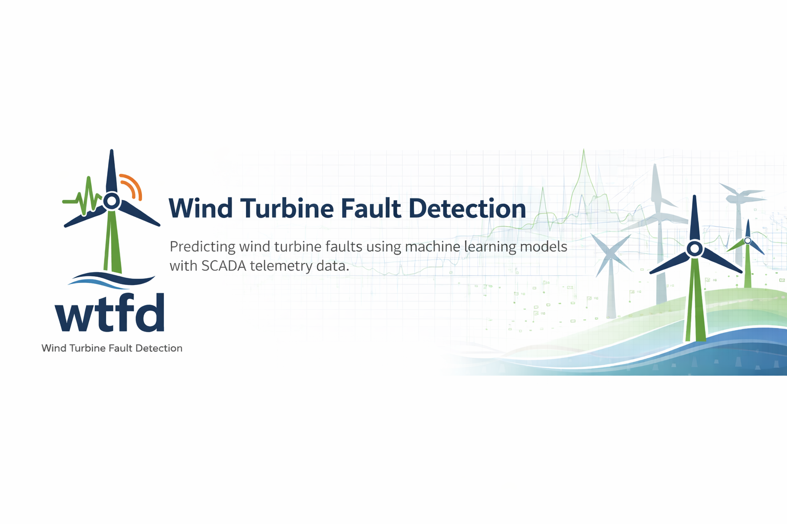

# Wind Turbine Fault Detection (WTFD)

End-to-end machine learning pipeline for predicting near-term wind turbine failures using SCADA data.



---

## Overview

Wind turbines are critical infrastructure in modern renewable energy systems. Unexpected failures lead to costly downtime, expensive repairs, and lost energy production.

This project develops a **data-driven predictive maintenance system** that uses historical SCADA telemetry to identify **early warning signals of turbine failure** within a future time horizon (24–72 hours).

The problem is formulated as a **binary classification task**, where each timestamp is labeled based on whether a failure event occurs within a defined future window.

This work demonstrates how machine learning can support condition-based maintenance and improve the reliability of renewable energy infrastructure.

---

## Objectives

- Predict turbine failures within **24h, 48h, and 72h horizons**
- Capture **temporal degradation patterns** using engineered features
- Compare multiple machine learning models:
  - Logistic Regression (baseline)
  - Random Forest
  - XGBoost
- Evaluate performance under **severe class imbalance**
- Align predictions with **real-world operational constraints**

---

## Key Insights

- Failure is a **gradual degradation process**, not a sudden event  
- Predictive signals are **distributed over time**, not localized  
- **Temporal features (rolling, lag, volatility)** are critical  
- Model performance is **consistent across prediction windows**  
- **Threshold tuning** is essential due to probability miscalibration  

---

## Project Structure

```bash
ML_Project/
├── src/wtfd/              # Core package (data, modeling, utilities)
├── notebooks/             # Experiment and pipeline notebooks
├── scripts/               # CLI-style pipeline entrypoints
├── data/                  # Raw and processed datasets
├── artifacts/             # Model outputs and experiment results
├── outputs/               # Generated figures and visualizations
├── documents/             # Project documentation
├── assets/                # Logos and visuals
├── config/                # Configuration files
```

See `documents/repository_structure.md` for a detailed breakdown.

## End-to-End Pipeline

1. Data ingestion (raw SCADA, multi-farm turbine data)
2. Preprocessing (cleaning, harmonization)
3. Feature engineering (rolling, lag, rate-of-change)
4. Labeling (24h / 48h / 72h windows + buffer zones)
5. Modeling (LR, RF, XGBoost)
6. Evaluation (PR metrics, threshold tuning, temporal analysis)

## Getting Started

Clone the repository

```bash
git clone https://github.com/cneiderer/ML_Project.git
cd ML_Project
```

Install

```bash
pip install -e .
```

Run preprocessing

```bash
python scripts/run_preprocessing.py
```

Run modeling experiments
```bash
python scripts/run_modeling.py
```

> Note: Running preprocessing and modeling will reproduce the full pipeline, including feature generation, model training, and artifact creation under `artifacts/` and `outputs/`.

## Example Outputs

- Feature importance
- Threshold curves
- Failure timelines
- Model comparison summaries

Artifacts:
- `artifacts/modeling/`
- `outputs/`

> Note: All outputs are generated dynamically during pipeline execution and are not version-controlled.

## Dataset

Kasimov, A. (2024)
https://zenodo.org/records/10958775

Challenges:
- Class imbalance
- Missing data
- Cross-farm inconsistencies

See `data/README.md` for full dataset structure and preprocessing details.

## Technologies
- Python (pandas, numpy, scikit-learn)
- XGBoost
- PyArrow
- Jupyter
- Custom package (wtfd)

## Current Results (XGBoost)

| Window | Precision | Recall | F1  |
| :----: | :-------: | :----: | :--: |
| 24h    | 0.125	 | 0.132	| 0.128 |
| 48h    | 0.127	 | 0.106	| 0.116 |
| 72h    | 0.127	 | 0.135	| 0.131 |

> Note: Absolute performance metrics are modest due to severe class imbalance and the inherent difficulty of predicting rare failure events. Results should be interpreted in the context of early-warning signal detection rather than point prediction accuracy.

## Documentation

- `documents/architecture.md`
- `documents/experiments.md`
- `documents/repository_structure.md`

## AI Use Disclosure

AI tools were used for documentation, structure, and code refinement.
All modeling and analysis were independently performed.

## License

MIT License
